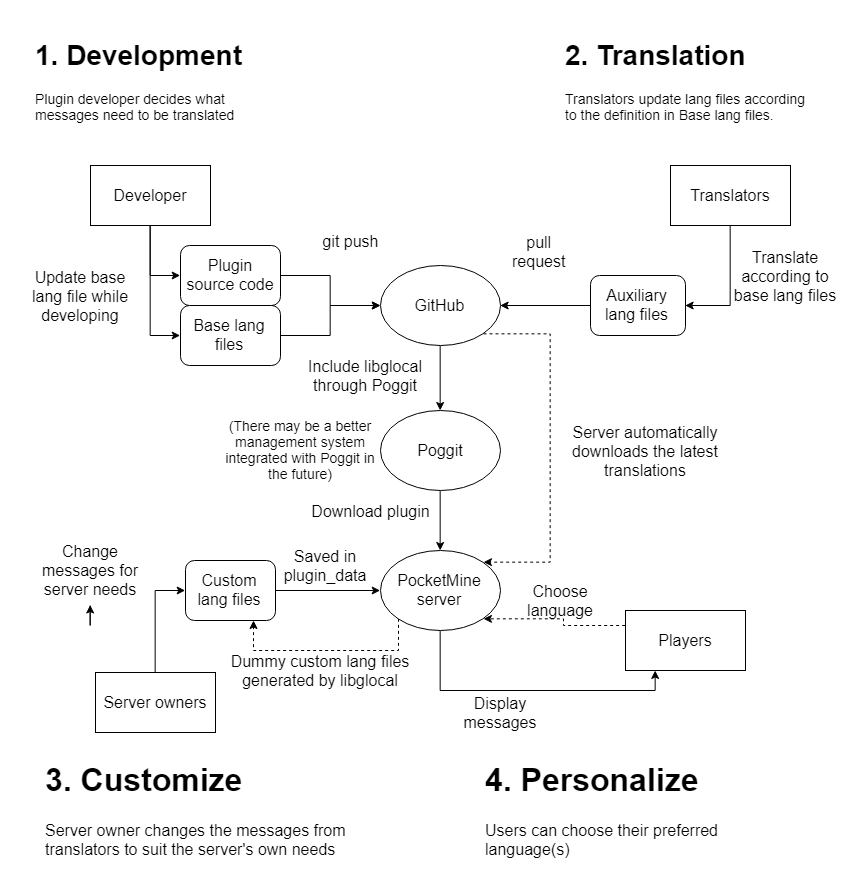

Guide for developers, translators and server owners
===
> Updated for libglocal version 0.3.0

## What is libglocal?
Libglocal is a library for PocketMine plugins to support multi-language display. Here are some highlighted features:
- Message arguments
	- Named argument substitution, e.g. `${foo}`
	- Argument types are checked
		- Supports complex argument: lists (simple arrays, ArrayAccess) and objects (associative arrays, traversable objects)
	- Arguments can be optional and use constant/fallback default values
	- Math rules to check numbers and display conditionally, e.g. `${cows @one={a cow} @={${1} cows}}`
- Message referencing, e.g. `#{message.name}`
	- A message can be included into another message for reuse, just like calling one function from another
- Styled comments
	- Apply stacked and named format spans, e.g. `%{error You are %{b not} an admin!}`
	- Works correctly even if included from another message
- Versioning system to update user customizations as plugin is upgraded
- Module system to make management easier
- Customization
	- Translations can be customized by server owner
	- Individual players and console can choose their own language

## The lifecycle of translations


In addition, libraries can be included before the plugin's lang files to facilitate the translation process.

To support this lifecycle, libglocal introduced a module system and a versioning scheme:
- Each module represents one plugin or one part of a big plugin, or represents a library
- Each module must have one and exactly one base lang file
- Modules can have dependencies such that one module cannot be loaded without another module. Dependency can be cyclic. Module (base lang file) load order is mostly random and is not affected by the dependency relationship.
- Each auxiliary/custom lang file translation *implements* a message from the base lang file
- Each message from the base lang file has a version (default is `null`, the lowest possible version)
- Each *implementation* targets at a version of the implemented message. If the implemented message has a newer version, the implementation is ignored.
- Auxiliary files are the lang files embedded with the plugin and the lang files downloaded automatically. Custom lang files are the ones found in the `plugin_data` folder.
- Non-base load order: embedded -> downloaded -> custom
- One module may have multiple non-base lang files even in the same language, and each message may be implemented multiple times in the same language. The last-loaded message is used.

## Getting started

### For developers
<details><summary>For developers</summary>

To use libglocal, just add this line to `onEnable()`: `$this->lang = Libglocal::init($this);` with the use statement `use SOFe\Libglocal\Libglocal`.

When you send a message, replace the message with `$this->lang->t($sender, "message.id", $args)`, where `$sender` is the recipient and `"message.id"` is the ID of the message to be translated. `$args` is an optional array that contains the parameters.

Then create the folder `lang` under `resources`, and create a file `en_US.lang` inside. (You can change `en_US` to another base language you like, but `en_US` is recommended for _base_ language, because that's usually the language most translators understand)

Then copy this into `en_US.lang`:

<details><summary>Template base lang file</summary>

```libglocal
base lang en_US English (US)
author AuthorName
version 0.1.0

messages PluginName
	my-first-message= Hello world!
```
</details>

Try calling `$player->sendMessage($this->lang->t($player, "PluginName.my-first-message"));` from your plugin. It should send "Hello world!" to the player.

Remember to replace `PluginName`, `AuthorName` with the plugin's name and author. `0.1.0` is the version for the base file, but it should resemble the plugin version, because it should be bumped every time messages in the plugin are changed publicly.
</details>

To translate a message, just write it like a base lang file. However, you don't need to (and should not) declare the arguments and docs again, because you are not defining the message.

### For translators
<details><summary>For translators</summary>

First, find the language code of the language you want to translate into. It should match the Minecraft client language codes. [Minecraft Wiki](https://minecraft.gamepedia.com/Language) has a table for this. In this part, I assume your language code is `zh_TW`.

Under the lang folder, create a file like this:

```libglocal
lang zh_TW 繁體中文
author AuthorName

messages ModuleName
```
</details>

Replace `AuthorName` with your (translator's) name. `ModuleName` is the name found behind the `messages` line of the base file, which is typically the plugin name. `0.1.0` should be replaced with the base lang version are translating.

### For server owners
<details><summary>For server owners</summary>

After downloading the plugin that uses libglocal, restart the server. Libglocal will generate the template lang files under the plugin's data folder. You may find one or multiple `.lang` files. Open them with [Notepad++](https://notepad-plus-plus.org) or any plain text editor you like. If you want to edit a message, delete the `//` at the start of the line you changed and the surrounding lines separated by empty lines.

For example, if the generated template is like this:

<details><summary>Original template</summary>

```libglocal
lang en_US English (US)
version 0.5.0

messages ExamplePlugin

//  lorem.ipsum = Dolor sit amet, consectetur adipiscing elit.
//    for 1.0

//  lorem.sed = Do eiusmod tempor incididunt ut labore et dolore magna aliqua.

//  lorem.ut = enim ad minim veniam, quis nostrud exercitation ullamco laboris.
//    for 1.0

//  nisi.in = Voluptate velit esse cillum dolore eu fugiat nulla pariatur.
//    | Excepteur sint non proident, sunt in culpa qui officia deserunt mollit anim id est laborum.
//    for 1.0

//  nisi.ut = Aliquip ex ea commodo consequat. Duis aute irure dolor in reprehenderit.
//    for 1.0
```
</details>

To change `Excepteur sint` to `Occaecat cupidatat`, this section becomes like this:

<details><summary>Edited file</summary>

```libglocal
lang en_US English (US)
version 0.5.0

messages ExamplePlugin

//  lorem.ipsum = Dolor sit amet, consectetur adipiscing elit.
//    for 1.0

//  lorem.sed = Do eiusmod tempor incididunt ut labore et dolore magna aliqua.

//  lorem.ut = enim ad minim veniam, quis nostrud exercitation ullamco laboris.
//    for 1.0

  nisi.in = Voluptate velit esse cillum dolore eu fugiat nulla pariatur.
    | Occaecat cupidatat non proident, sunt in culpa qui officia deserunt mollit anim id est laborum.
    for 1.0

//  nisi.ut = Aliquip ex ea commodo consequat. Duis aute irure dolor in reprehenderit.
//    for 1.0
```
</details>

## Basics

### Libglocal file format
#### Lexing rules
<details>
<summary>Technical details</summary>

The generic rules for libglocal file syntax:
- **EMPTY**: If the line only consists of spaces and tabs (_whitespace characters_), the line is called an "empty line".
- **COMMENT**: If the line starts with `//` (excluding leading spaces), it is a comment line
- **INDENT**: The leading _whitespace characters_ of the line are called the _indent_. They control the line groupings.
- **INDENT_CHILD**: If the _indent_ of a line starts with that of the previous line and is longer, the line is a _child_ of the previous line.
- **INDENT_SIBLING**: If two lines have the same _indent_ and all lines between them (if any) are _descendents_ (_children_ or recursive _children_) of the first line, the two lines are _siblings_.
- **INDENT_ERROR**: If a line is not the first line and cannot be identified as a _child_ of the previous line or as the _sibling_ of any lines before it, it has an indentation error.
- **IDENTIFIER**: An _identifier_ is a consecutive string containing only one or more latin alphabets `A-Z` `a-z`, digits `0-9`, hyphens `-`, underscores `_` and dots `.`.
- **IDENTIFIER_LIST**: A line consists of one or multiple _identifiers_, separated by _whitespace characters_.
- **IDENTIFIER_SYMBOL**: `$` and `~` are parsed as an _identifier_ only if placed at the start of a line. They can be followed by normal _identifiers_ without _whitespace characters_ in between.
- **IDENTIFIER_FLAG**: An _identifier_ (except the last one) can be followed by a `:` character, which means the _identifier_ is a _flag_ on the _identifier_ following it. There must be no _whitespace characters_ around the colon. There may be multiple _flags_ on the same _identifier_.
- **IDENTIFIER_DELIM**: The last _identifier_ can be followed by a `=` character. The part behind the `=`, separated by zero or more _whitespace characters_, is a _literal_.
- **LITERAL_SYMBOL**: `*` functions the same way to the lexer as a `=` if placed at the start of a line, so it can be followed by a _literal_ after zero or more _whitespace characters_.
- **LITERAL**: A _literal_ consists of zero or multiple of the following components:
  - Simple static components: *LITERAL_SIMPLE*, *LITERAL_ESCAPE*, *LITERAL_CONT*
  - Complex static components: *LITERAL_SPAN*
  - Complex dynamic components: *LITERAL_REF*
- **LITERAL_SIMPLE**: A **LITERAL_SIMPLE** component consists of one or multiple consecutive UTF-8 characters except `#` `$` `%` `\` `}`  and _newline_ (Unix-style LF `\n` or Windows-style CRLF `\r\n`).
- **LITERAL_ESCAPE**: A **LITERAL_ESCAPE** component consists of a `\` followed by one ASCII character. (Only certain characters are allowed behind the `\`, but the restriction is not part of the lexing rules)
- **LITERAL_CONT**: A **LITERAL_CONT** component consists of a _newline_ followed by zero or multiple _whitespace characters_, then one of `!`, `|` or `\`. The _whitespace characters_ in between are NOT parsed using **INDENT** rules.
- **LITERAL_SPAN**: A **LITERAL_SPAN** component has the format (`%{`, _identifier_, _whitespace characters_, _literal_, `}`).
- **LITERAL_REF**: A **LITERAL_REF** component starts with `#{`, `${` or `#{$`, followed by an _identifier_, finally a `}`. There can be a `REF_ARG_LIST` between the _identifier_ and the `}`.
- **REF_ARG_LIST**: A recurring sequence of (*REF_ARG_NAME*, `=`, *REF_ARG*), delimited by a `}`. *REF_ARG_NAME* is an _identifier_ with an optional `@` in front of it. *REF_ARG* is either a _number_ (an unsigned or negative-signed integer or decimal number), or an _identifier_, or a pair of `{}` with a _literal_ inside.
- **MATH_SYMBOL**: `@` placed at the start of a line indicates that the line is a math rule. It must be followed by one or more `@`, or an _identifier_, or both, then _whitespace characters_. After that, _numbers_, modulus sign `@` and _comparator_ (one of `=` `!=` `<>` `<=` `>=` `<` `>`) and _whitespace characters_ are allowed in the line.
</details>

#### Metadata part
The file consists of two parts. The first part is the metadata part, which can contain
- a required `lang`/`base lang` statement
- zero or multiple `author` statements
- an optional `version` statement
- zero or multiple `require` statements
- zero or multiple `use` statements

The `lang`/`base lang` statement indicates the language of the file. It should be in the format `base lang lang_id = Language Name` or `lang lang_id = Language Name`, where `lang_id` is the [language code](https://minecraft.gamepedia.com/Language) and `Lauguage Name` is the local name of the language.

`author` statements list the author names. All translators should be included in the author list. The format is `author = AuthorName`.

### Messages
A message is something to be translated. It can be a sentence, a few big passage, or just one word. The definition
